<p align="center">
  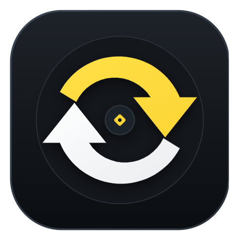
</p>

<h1 align="center">Converter Nest</h1>

<p align="center">
  <strong>Universal, 100% Free & Offline On-Device File Converter for Android</strong><br>
  <em>Convert 40+ media, document, and data formats natively on your phone — zero servers, zero subscriptions, complete privacy.</em>
</p>

<p align="center">
  
  
  
  
  
  
</p>

<p align="center">
  <a href="https://github.com/CodeWith-AR/ConverterNest/releases/download/v1.0.0/ConverterNest-v1.0.0.apk">
    
  </a>
  <a href="https://github.com/CodeWith-AR/ConverterNest/releases/tag/v1.0.0">
    
  </a>
</p>

---

## 📲 Download & Install

Get Converter Nest directly on your Android phone without waiting for the Play Store:

<p align="center">
  <a href="https://github.com/CodeWith-AR/ConverterNest/releases/download/v1.0.0/ConverterNest-v1.0.0.apk">
    
  </a>
</p>

### 📱 Easy Installation Steps:
1. **Tap the Download button** above on your Android phone to download `ConverterNest-v1.0.0.apk`.
2. **Open the downloaded APK** from your browser notifications or your phone's Downloads folder.
3. If Android prompts you (*"For security, your phone is not allowed to install unknown apps from this source"*), tap **Settings** and toggle **Allow from this source**.
4. Tap **Install** and open **Converter Nest**! 🚀

---

## 🌟 Overview

**Converter Nest** is a privacy-first mobile file utility engineered in Flutter & Dart. Unlike mainstream converters (CloudConvert, Zamzar, iLovePDF) that upload your private photos, videos, confidential documents, and voice recordings to remote cloud servers, Converter Nest runs **100% locally on your device's processor**.

Your files never leave your phone. No internet connection is ever required, and there are zero file size limits or paywalls.

---

## ⚡ Why Converter Nest?

| Feature | Cloud Converters (Traditional) | 🪶 Converter Nest (On-Device) |
| :--- | :--- | :--- |
| **Privacy & Security** | Files uploaded to 3rd-party servers | **100% Private — Zero cloud uploads** |
| **Internet Required** | Yes (heavy cellular data usage) | **No — Operates completely offline** |
| **File Size Limits** | Capped (typically 25MB–100MB on free tiers) | **Unlimited (only limited by device storage)** |
| **Cost & Subscriptions** | $8–$15 / month paywalls | **100% Free Forever** |
| **Processing Speed** | Cloud queues + upload/download latency | **Instantaneous native CPU/GPU execution** |
| **Telemetry & Ads** | Tracking cookies and third-party analytics | **Zero tracking, zero analytics** |

---

## 📱 App Screenshots

### 🚀 Onboarding & Experience
| Splash Screen | Onboarding: Convert Anything | Onboarding: Free Forever | Home Dashboard |
| :---: | :---: | :---: | :---: |
| 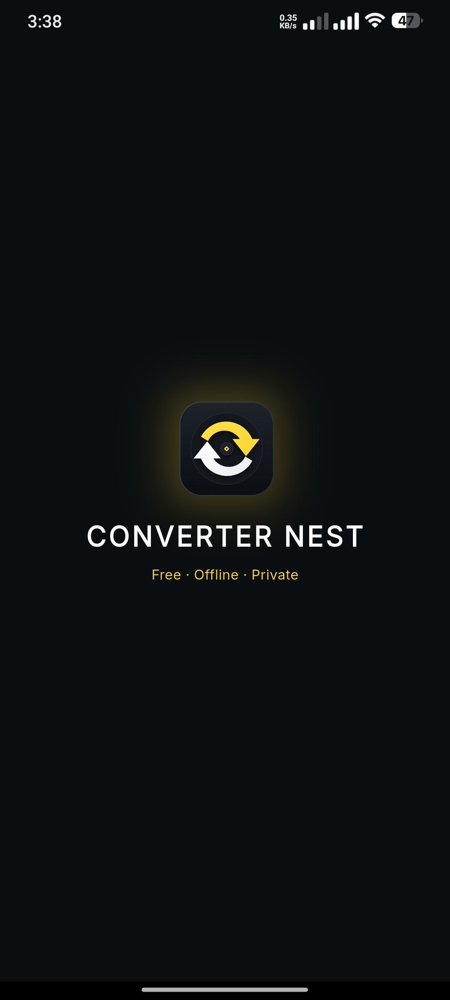 | 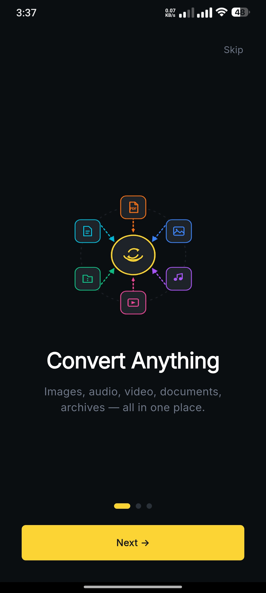 | 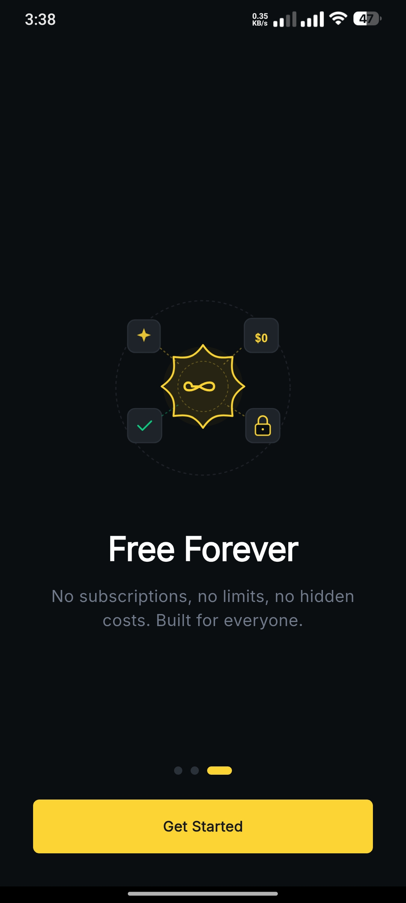 | 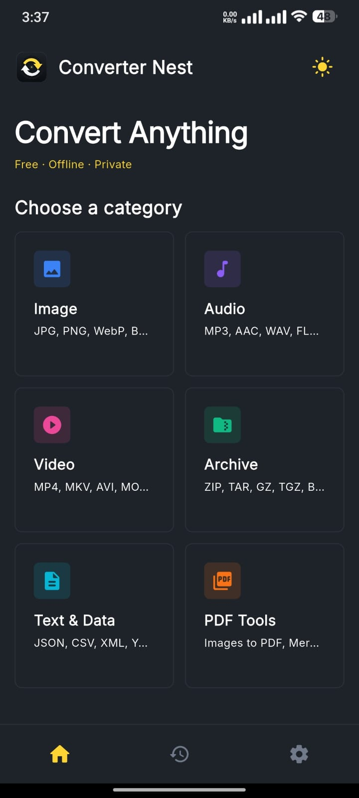 |

### 🛠️ Conversion Engines
| Image Converter | Audio Converter | Video Converter | Archive Manager |
| :---: | :---: | :---: | :---: |
| 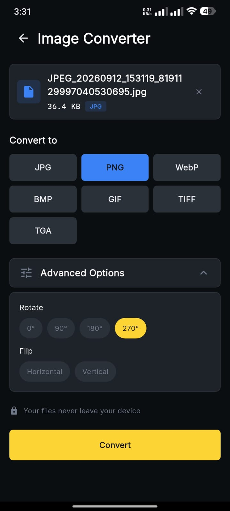 | 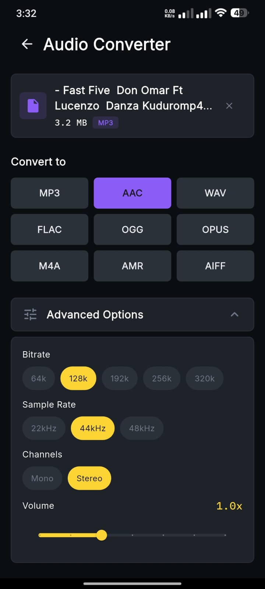 | 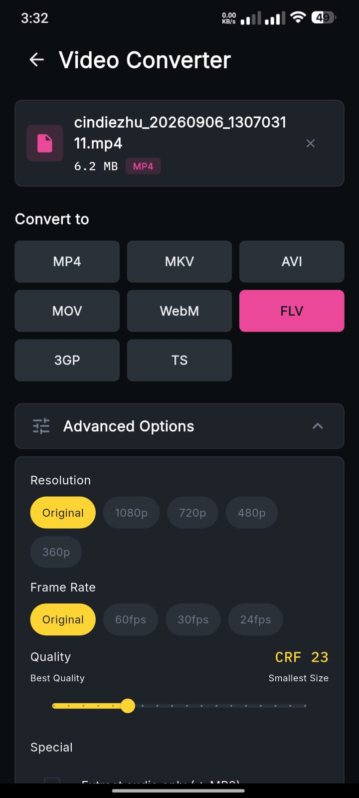 | 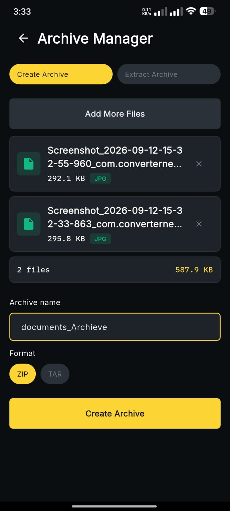 |

### 📑 Document Tools, History & Settings
| Text & Data Converter | PDF Tools | Conversion Result | History & Auditing | Settings & Info |
| :---: | :---: | :---: | :---: | :---: |
| 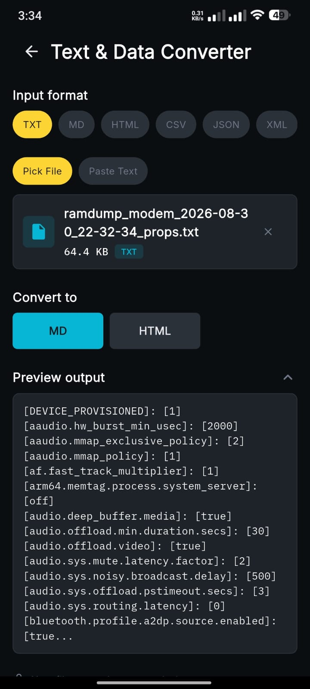 | 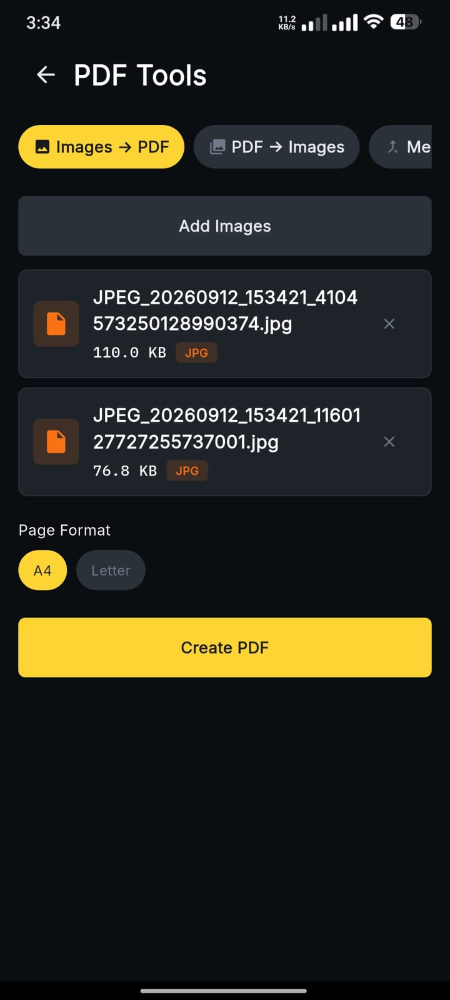 | 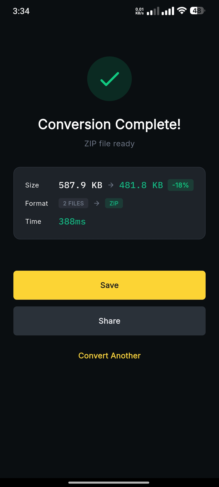 | 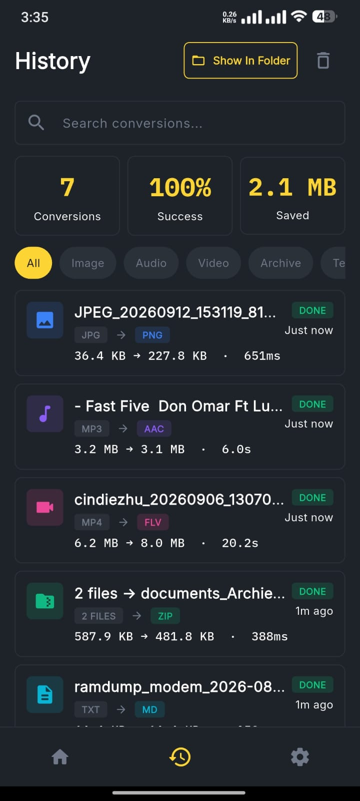 | 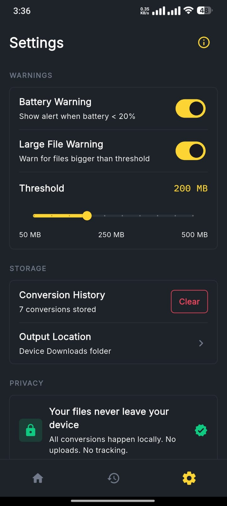 |

---

## 🛠️ 6 Core Conversion Suites

### 1. 🖼️ Image Studio
* **Supported Formats:** JPG, PNG, WEBP, BMP, GIF, TIFF, TGA, ICO
* **Features:**
  * Lossy & lossless compression quality sliders (1%–100%)
  * Dimensional scaling & aspect ratio preservation
  * Multi-image batch processing
  * Metadata preservation or privacy stripping
* **Engine:** Pure Dart `image` package with isolated multi-threaded compute workers.

### 2. 🎵 Audio Suite
* **Supported Formats:** MP3, WAV, FLAC, AAC, OGG, OPUS, M4A, AMR, AIFF
* **Features:**
  * Video-to-Audio soundtrack extraction (MP4/MKV to high-fidelity MP3/FLAC/AAC)
  * Bitrate controls: 64 kbps, 128 kbps, 192 kbps, 256 kbps, 320 kbps
  * Sample rate tuning: 22.05 kHz, 44.1 kHz, 48 kHz
  * Audio channel selection (Mono / Stereo)
* **Engine:** Native hardware-accelerated `ffmpeg_kit_flutter_new`.

### 3. 🎬 Video Engine & Compressor
* **Supported Formats:** MP4, MKV, AVI, MOV, WebM, FLV, 3GP, TS, Animated GIF
* **Features:**
  * Constant Rate Factor (CRF) video compression (save up to 80% file size)
  * Resolution re-scaling (480p, 720p, 1080p, Source)
  * Audio track extraction & video-to-GIF conversion
  * Frame rate (FPS) and video bitrate adjustments
* **Engine:** Full FFmpeg native C/C++ pipeline.

### 4. 📦 Archive Manager
* **Supported Formats:** ZIP, TAR, GZ, TGZ, BZ2, XZ, 7Z
* **Features:**
  * Multi-file compression & packaging
  * One-tap archive decompression and extraction
  * File integrity verification
* **Engine:** High-performance Dart `archive` engine.

### 5. 🔄 Data & Document Transformer
* **Supported Formats:** JSON, CSV, XML, YAML, TXT, MD
* **Features:**
  * Bi-directional conversions (CSV ⇄ JSON, JSON ⇄ XML, Markdown ⇄ HTML)
  * Formatted pretty-printing and token minification
  * Local schema parsing without server endpoints
* **Engine:** Native Dart stream parsers & transformers.

### 6. 📑 PDF Swiss Army Knife
* **Supported Operations:**
  * Multiple images to PDF compiler with custom orientation & margins
  * Multi-document PDF merge
  * Page splitting, extraction, and rearrangement
* **Engine:** Native vector rendering via `pdf` and `pdfx`.

---

## 🎨 Design & Experience

* **Dynamic Theme Switcher:** Seamless real-time switching between Light and Dark themes with full component adaptation.
* **Organized Storage:** Converted files are automatically categorized and stored in `Downloads/ConverterNest/{category}` for effortless discovery.
* **"Show In Folder" Integration:** Open converted files directly in your Android file manager with one tap.
* **Job History:** Audit trail powered by lightweight local Hive database with persistent logs and direct sharing.
* **Relaxed Cinematic Animations:** Smooth page transitions and micro-interactions powered by Flutter's animation framework.

---

## 🏛️ Architecture & Project Structure

Converter Nest adheres to **Clean Architecture** with the **MVVM (Model-View-ViewModel)** pattern:

```
lib/
├── app/
│   ├── app.dart                   # Root MaterialApp & dynamic theme provider
│   └── routes/                    # Declarative GoRouter navigation
├── core/
│   ├── constants/                 # Design tokens, color palette, typography
│   ├── services/
│   │   ├── app_storage_service.dart # Universal Downloads/ConverterNest storage manager
│   │   └── theme_provider.dart      # Dark/Light mode state management
│   ├── theme/                     # Light & Dark theme definitions
│   └── utils/                     # Format formatters, mime-types, file helpers
│   └── widgets/                   # Reusable UI components & stat cards
└── modules/
    ├── home/                      # Dashboard & format category browser
    ├── image_converter/           # Image Studio module
    ├── audio_converter/           # Audio Suite module
    ├── video_converter/           # Video Engine module
    ├── archive_manager/           # Archive Manager module
    ├── data_converter/            # Data & Document Transformer module
    ├── pdf_tools/                 # PDF Suite module
    ├── history/                   # Local Hive conversion history
    ├── settings/                  # User preferences, app info dialog & storage paths
    └── onboarding/                # First-launch introduction flow
```

---

## 🚀 Getting Started

### Prerequisites
* [Flutter SDK](https://docs.flutter.dev/get-started/install) (3.24.0 or higher recommended)
* [Dart SDK](https://dart.dev/get-dart) (3.3.0 or higher)
* Android Studio or VS Code with Flutter extension
* Android SDK Platform 31+ / Android Device or Emulator (API 21+)

### Installation & Run

1. **Clone the repository:**
   ```bash
   git clone https://github.com/CodeWith-AR/ConverterNest.git
   cd ConverterNest
   ```

2. **Install dependencies:**
   ```bash
   flutter pub get
   ```

3. **Run on an Android device or emulator:**
   ```bash
   flutter run
   ```

4. **Build release APK:**
   ```bash
   flutter build apk --release
   ```

---

## 🔒 Privacy & Permissions

* **No Network Required:** The app does not transmit data or communicate with external servers.
* **Storage Access:** Standard Android storage permissions (`READ_MEDIA_*` / `READ_EXTERNAL_STORAGE` / `MANAGE_EXTERNAL_STORAGE`) are requested solely to read input files selected by the user and save converted output files to `Downloads/ConverterNest`.

---

## 👨‍💻 Author

**Abdur Rehman**
* **GitHub:** [@CodeWith-AR](https://github.com/CodeWith-AR)
* **LinkedIn:** [Abdur Rehman](https://www.linkedin.com/in/abdurrehman-se)
* **Email:** [mailrehman90527300@gmail.com](mailto:mailrehman90527300@gmail.com)

---

## 📄 License

This project is open source and available under the [MIT License](LICENSE).
